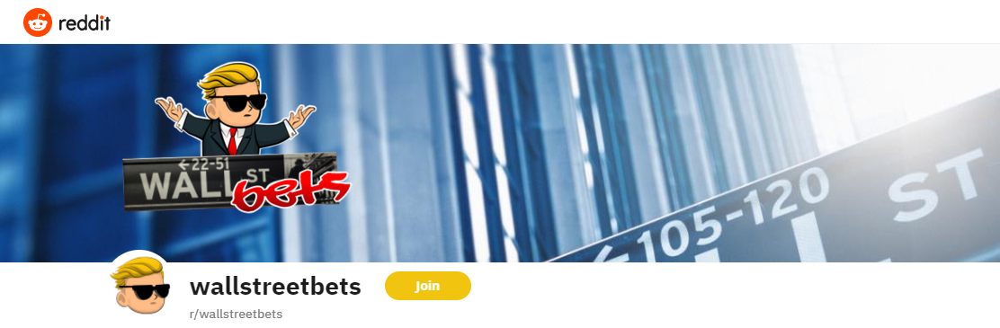

<!--
*** Thanks for checking out the Best-README-Template. If you have a suggestion
*** that would make this better, please fork the repo and create a pull request
*** or simply open an issue with the tag "enhancement".
*** Thanks again! Now go create something AMAZING! :D
-->

<!-- PROJECT SHIELDS -->
<!--
*** I'm using markdown "reference style" links for readability.
*** Reference links are enclosed in brackets [ ] instead of parentheses ( ).
*** See the bottom of this document for the declaration of the reference variables
*** for contributors-url, forks-url, etc. This is an optional, concise syntax you may use.
*** https://www.markdownguide.org/basic-syntax/#reference-style-links
-->
[![Contributors][contributors-shield]][contributors-url]
[![Forks][forks-shield]][forks-url]
[![Stargazers][stars-shield]][stars-url]
[![Issues][issues-shield]][issues-url]
[![MIT License][license-shield]][license-url]
[![LinkedIn][linkedin-shield]][linkedin-url]

<!-- PROJECT LOGO -->
 

  

  <h3 align="center">r/Wallstreetbets Activity Monitor</h3>

  

    A repo to analyze the subreddit r/wallstreetbets
     
    <a href="https://github.com/WSBmonitor/main"><strong>Explore the docs »</strong></a>
     
     
    ·
    <a href="https://github.com/WSBmonitor/issues">Report Bug</a>
    ·
    <a href="https://github.com/WSBmonitor/issues">Request Feature</a>
  

  
<!-- TABLE OF CONTENTS -->
# Table of Contents
    
* <a href="#about-the-project">About The Project</a>
  * <a href="#built-with">Built With</a>
  * <a href="#getting-started">Getting Started</a>
* <a href="#usage">Usage</a>
  * <a href="#roadmap">Roadmap</a>
  * <a href="#contributing">Contributing</a>
  * <a href="#license">License</a>
  * <a href="#contact">Contact</a>
  * <a href="#acknowledgements">Acknowledgements</a>
  
<!-- Banner -->
 

  

<!-- ABOUT THE PROJECT -->
## About The Project

Over the past month, I think it has become very clear that Reddit's degenerate filled, gambling addicted, memestock enthusiasts subreddit r/wallstreetbets has been having noticable impacts in the stock market. I say these descriptions with endearment. The purpose of this repo is to collect data such as: stock ticker mentions; posted trades; And then do analysis to be able to better describe the impact they are having. All findings will be posted free on a hosting site TBD.  

<!-- Built With -->
### Built With

<!-- GETTING STARTED -->
## Getting Started

<!-- USAGE EXAMPLES -->
## Usage

Use this space to show useful examples of how a project can be used. Additional screenshots, code examples and demos work well in this space. You may also link to more resources.

_For more examples, please refer to the [Documentation](https://example.com)

<!-- ROADMAP -->
## Roadmap

See the [open issues](https://github.com/WSBmonitor/issues) for a list of proposed features (and known issues).

<!-- CONTRIBUTING -->
## Contributing

Contributions are what make the open source community such an amazing place to be learn, inspire, and create. Any contributions you make are **greatly appreciated**.

1. Fork the Project
2. Create your Feature Branch (`git checkout -b feature/AmazingFeature`)
3. Commit your Changes (`git commit -m 'Add some AmazingFeature'`)
4. Push to the Branch (`git push origin feature/AmazingFeature`)
5. Open a Pull Request

<!-- LICENSE -->
## License

Distributed under the MIT License. See `LICENSE` for more information.

<!-- CONTACT -->
## Contact

Tyler Blue - [u/tjbluedev](https://reddit.com/u/tjbluedev) - tjblue2@asu.edu

Project Link: [https://github.com/tjblue/WSBmonitor](https://github.com/tjblue/WSBmonitor)

<!-- ACKNOWLEDGEMENTS -->
## Acknowledgements
* [Example](https://www.google.com)

<!-- MARKDOWN LINKS & IMAGES -->
<!-- https://www.markdownguide.org/basic-syntax/#reference-style-links -->
[contributors-shield]: https://img.shields.io/github/contributors/tjblue/WSBmonitor.svg?style=for-the-badge
[contributors-url]: https://github.com/WSBmonitor/graphs/contributors
[forks-shield]: https://img.shields.io/github/forks/tjblue/WSBmonitor.svg?style=for-the-badge
[forks-url]: https://github.com/WSBmonitor/network/members
[stars-shield]: https://img.shields.io/github/stars/tjblue/WSBmonitor.svg?style=for-the-badge
[stars-url]: https://github.com/WSBmonitor/stargazers
[issues-shield]: https://img.shields.io/github/issues/tjblue/WSBmonitor.svg?style=for-the-badge
[issues-url]: https://github.com/WSBmonitor/issues
[license-shield]: https://img.shields.io/github/license/tjblue/WSBmonitor.svg?style=for-the-badge
[license-url]: https://github.com/WSBmonitor/blob/master/LICENSE.txt
[linkedin-shield]: https://img.shields.io/badge/-LinkedIn-black.svg?style=for-the-badge&logo=linkedin&colorB=555
[linkedin-url]: https://linkedin.com/in/tylerblue2023
[product-screenshot]: images/screenshot.png
